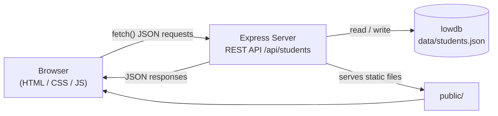

# Student Management System

A small full-stack app for keeping student records. You can add, edit, search and delete students, see a breakdown by status, year and course, and export or import the data.

It is built with **Express** (backend + REST API), **lowdb** (data saved to a JSON file) and **plain HTML, CSS and JavaScript** (frontend, no framework or build step).

## Quick start

You need [Node.js](https://nodejs.org) 18.11 or newer.

```bash
npm install
npm run dev
```

Then open **http://localhost:4000**.

The first run creates `data/students.json` with three sample students.

| Command | What it does |
| --- | --- |
| `npm run dev` | Starts the server and restarts it whenever `server.js` changes |
| `npm start` | Starts the server without auto-restart |

To use a different port, set `PORT` before starting: `PORT=5000 npm start` in Git Bash, or `$env:PORT=5000; npm start` in PowerShell. If the port is already in use, the server tries the next one (up to 10 tries) and prints the address it ends up on.

> Always open the app through the server address. Opening `public/index.html` directly from the folder shows the page, but no student data can load.

## Features

- **Students:** a table of all students with search (name, email, course, phone), a status filter and sorting (name, newest, year, course)
- **Add / edit:** a form with validation. Email addresses must be unique.
- **Delete:** with a confirmation prompt
- **Summary cards:** total, active, on leave, and Year 4 students who haven't graduated yet
- **Insights:** bars by status, year and course, plus the five newest students
- **Settings:** export to CSV or JSON, and import from a JSON backup (existing emails are skipped)
- **Works on phones:** the sidebar turns into tabs on narrow screens

## Project structure

```
├── server.js          Backend: Express server, validation, API routes
├── package.json       Dependencies and npm scripts
├── data/
│   └── students.json  The data file (created on first run, git-ignored)
└── public/            Frontend, served as static files
    ├── index.html     Page structure: Students, Insights and Settings views + the form
    ├── styles.css     Styles
    └── app.js         Loads data from the API, draws the page, handles clicks
```

**How it fits together:** the browser loads the files in `public/`. `app.js` calls the API with `fetch`. `server.js` checks the request, reads or writes `data/students.json` and replies with JSON. Search, filtering, sorting and switching views all happen in the browser, with no extra requests.

## API

All endpoints accept and return JSON.

| Method | Endpoint | Description | Success |
| --- | --- | --- | --- |
| `GET` | `/api/students` | List all students, sorted by name. Optional `?search=` | `200` |
| `GET` | `/api/students/:id` | Get one student | `200` |
| `POST` | `/api/students` | Create a student | `201` |
| `PUT` | `/api/students/:id` | Update a student | `200` |
| `DELETE` | `/api/students/:id` | Delete a student | `204` |

**Request body** for `POST` and `PUT`:

```json
{
  "name": "Maya Patel",
  "email": "maya.patel@northstar.edu",
  "course": "Computer Science",
  "year": "Year 3",
  "status": "Active",
  "phone": "+1 555 010 2841"
}
```

- `name`, `email`, `course` and `year` are required.
- `status` must be `Active`, `On leave` or `Graduated`; it defaults to `Active`.
- `phone` is optional.
- The server adds `id`, `createdAt` and `updatedAt`, trims every field, and lowercases the email.

**Errors** come back as `{ "error": "message" }`:

| Status | When |
| --- | --- |
| `400` | A required field is missing, the email is invalid, or the status is invalid |
| `404` | No student has that id, or the API route doesn't exist |
| `409` | Another student already has that email |
| `500` | The data couldn't be saved |

**Example:**

```bash
curl -X POST http://localhost:4000/api/students \
  -H "Content-Type: application/json" \
  -d '{"name":"Test User","email":"test@example.com","course":"Math","year":"Year 1"}'
```

## Data and backups

All data lives in `data/students.json`.

- **Back up:** copy that file, or use **Settings → Download JSON** in the app.
- **Start fresh:** stop the server, delete the file and start the server again. The three sample students come back.
- **Edit the file by hand:** stop the server first. The server reads the file only when it starts, and its next save would overwrite your edits.

## Troubleshooting

| Problem | Fix |
| --- | --- |
| `EADDRINUSE: address already in use` | Another program is using the port. The server tries the next 10 ports on its own; if they're all taken, set a different `PORT`. |
| Sidebar links or buttons do nothing | Make sure you opened `http://localhost:4000` and not the HTML file, then press Ctrl+F5 to reload without the cache. |
| "Could not load records." | The server isn't running. Start it with `npm run dev`. |
| `node --watch` is not recognised | Your Node.js is older than 18.11. Update it, or use `npm start`. |


# Student Management System

A full-stack web application for managing student records. It is built with Node.js, Express and a plain HTML, CSS and JavaScript frontend, and it saves data in a JSON file through lowdb.


---

## Overview

The **Student Management System** is a single-page dashboard for keeping a directory of students. Each record holds a name, email, course, year, status and phone number.

- **What it does:** You can create, view, update and delete student records. The app also shows summary statistics and simple breakdowns of the data, and it can export and import records.
- **Problem it solves:** It replaces spreadsheets or paper lists with one searchable interface. The server checks the data, so required fields must be present and email addresses must be unique.
- **Who can use it:** Small teams, tutors or administrators who need a simple record-keeping tool. It is also a learning project for full-stack development.
- **Main purpose:** To show a complete working full-stack flow: a browser frontend talks to a REST API, and the API saves the data.

> **Note:** This is a learning project. It has **no authentication**, and it is intended to run locally or in a trusted environment.

---

## Features

- **Student directory:** A table of all students with initials avatars, course, year, status and contact details.
- **Create, edit and delete:** Records are added and edited in a modal form. Deleting a record asks for confirmation first.
- **Server-side validation:**
  - Name, email, course and year are required.
  - The email format is checked.
  - The status must be one of the allowed values.
  - Duplicate emails are rejected.
- **Search, filter and sort:**
  - Search by name, email, course or phone.
  - Filter by status.
  - Sort by name, newest, year or course.
  - A reset button clears all filters.
- **Course picker:** A list of 21 preset courses, plus any custom courses already saved. An **"Other"** option lets you type a new course.
- **Summary cards:**
  - Total students
  - Active students
  - Students on leave
  - "Graduating soon" (Year 4 students who have not graduated yet)
- **Insights view:** Bar breakdowns by status, year and course, and a list of the five most recently added students.
- **Settings view:**
  - Export all records as **CSV** or **JSON**.
  - Import students from a **JSON** backup. Records that fail validation, such as existing emails, are skipped.
- **Hash-based navigation:** The Students, Insights and Settings views switch without reloading the page (`#students`, `#insights`, `#settings`).
- **Responsive layout:** On narrow screens the sidebar becomes a top tab bar.
- **User feedback:** Toast notifications for success and error messages, and inline form errors.
- **Basic XSS protection:** User-supplied values are HTML-escaped before they are shown on the page.

---

## Tech Stack

### Frontend
- HTML5
- CSS3 (custom styles, no CSS framework)
- Vanilla JavaScript (ES6+), using the Fetch API to call the backend

### Backend
- [Node.js](https://nodejs.org/)
- [Express](https://expressjs.com/) `^4.21.2`: REST API and static file serving

### Database
- [lowdb](https://github.com/typicode/lowdb) `^1.0.0` with the `FileSync` adapter. Data is stored in a local JSON file (`data/students.json`).

### Tools / Other Technologies
- npm (package management and scripts)
- Node.js `--watch` mode for auto-restart during development
- Git and GitHub (version control)

---

## System Architecture

The browser loads the static frontend from the Express server. The frontend then sends JSON requests to the REST API. The backend validates each request and reads or writes the JSON file through lowdb.



**Request flow:** User action → `app.js` calls the API with `fetch` → `server.js` validates the request → lowdb updates `students.json` → a JSON response is sent → the UI re-renders.

Search, filtering, sorting, statistics and view switching all run **in the browser** on data that is already loaded. They do not send extra API calls.

---

## Project Structure

```text
Student-Management-System/
├── public/                 # Frontend (served as static files by Express)
│   ├── index.html          # Layout: sidebar, Students / Insights / Settings views, modal form
│   ├── styles.css          # All styling, including responsive breakpoints
│   └── app.js              # API calls, rendering, search/filter/sort, import/export, events
├── data/
│   └── students.json       # Data file (created automatically on first run; git-ignored)
├── .github/
│   └── copilot-instructions.md
├── server.js               # Express server: validation, REST API routes, lowdb setup
├── package.json            # Project metadata, dependencies and npm scripts
├── package-lock.json
├── .gitignore              # Ignores node_modules/, data/ and .env
└── README.md
```

---

## API Endpoints

Base URL (local): `http://localhost:4000`

All endpoints accept and return JSON.

| Method | Endpoint | Description | Success |
| ------ | -------- | ----------- | ------- |
| `GET` | `/api/students` | List all students sorted by name. Optional query `?search=` matches name, email or course. | `200` |
| `GET` | `/api/students/:id` | Get a single student by ID | `200` |
| `POST` | `/api/students` | Create a new student | `201` |
| `PUT` | `/api/students/:id` | Update an existing student | `200` |
| `DELETE` | `/api/students/:id` | Delete a student | `204` |

Any other path under `/api` returns `404`. All non-API routes serve `public/index.html`.

### Request Body (`POST` / `PUT`)

```json
{
  "name": "Maya Patel",
  "email": "maya.patel@northstar.edu",
  "course": "Computer Science",
  "year": "Year 3",
  "status": "Active",
  "phone": "+1 555 010 2841"
}
```

| Field | Required | Rules |
| ----- | -------- | ----- |
| `name` | Yes | Trimmed |
| `email` | Yes | Must be a valid format. Stored in lowercase. Must be unique. |
| `course` | Yes | Trimmed |
| `year` | Yes | The UI offers `Year 1` – `Year 4` |
| `status` | No | `Active`, `On leave` or `Graduated`. Defaults to `Active`. |
| `phone` | No | Trimmed |

The server generates `id`, `createdAt` and `updatedAt` automatically.

### Error Responses

Errors are returned as `{ "error": "message" }`.

| Status | Meaning |
| ------ | ------- |
| `400` | A required field is missing, the email is invalid, or the status is invalid |
| `404` | Student not found, or unknown API route |
| `409` | Another student already uses this email |
| `500` | The server could not create or update the record |

### Example

```bash
curl -X POST http://localhost:4000/api/students \
  -H "Content-Type: application/json" \
  -d '{"name":"Test User","email":"test@example.com","course":"Mathematics","year":"Year 1"}'
```

---

## Database

- **Technology:** lowdb v1, a lightweight JSON file database, using the synchronous `FileSync` adapter.
- **Storage location:** `data/students.json`. The folder and file are created automatically when the server starts.
- **Seed data:** If the collection is empty, three sample students are inserted on startup.
- **Collection:** `students`. It is a single collection, so there are no relationships between entities.

| Field | Type | Description |
| ----- | ---- | ----------- |
| `id` | Number | Unique ID generated by the server |
| `name` | String | Full name |
| `email` | String | Lowercased and unique |
| `course` | String | Course name |
| `year` | String | e.g. `Year 1` |
| `status` | String | `Active` / `On leave` / `Graduated` |
| `phone` | String | Optional |
| `createdAt` | String | ISO 8601 timestamp |
| `updatedAt` | String | ISO 8601 timestamp |

> The `data/` folder is listed in `.gitignore`, so student data is never committed to the repository.

---

## Authentication & Authorization

**Authentication and authorization are not implemented.** There is no login, registration, session, token or role-based access control. Anyone who can reach the server can read and change all records.

The sidebar shows a user name ("Jamie Davis – Administrator"), but this is **placeholder text only**. It is not linked to any user account.

---

## Installation & Setup

### Prerequisites

- [Node.js](https://nodejs.org/) **18.11 or newer**. This is needed for `npm run dev`, which uses `node --watch`.
- npm (included with Node.js)
- Git

### 1. Clone the repository

```bash
git clone https://github.com/SamniHasnath/Student-Mangemnt-System.git
```

### 2. Navigate into the project

```bash
cd Student-Mangemnt-System
```

### 3. Install dependencies

```bash
npm install
```

### 4. Configure environment variables

This step is optional. No `.env` file is required. See [Environment Variables](#environment-variables).

### 5. Set up the database

No manual setup is needed. On first start, the server creates `data/students.json` and adds three sample students.

### 6. Start the application

```bash
# Development (auto-restarts when server.js changes)
npm run dev

# Production-style start
npm start
```

### 7. Open the frontend

The Express server also serves the frontend, so there is **no separate frontend server**. Open:

```
http://localhost:4000
```

> ⚠️ Always open the app through the server URL. Opening `public/index.html` directly from the file system will not load any data.

| Script | Command | Description |
| ------ | ------- | ----------- |
| `npm run dev` | `node --watch server.js` | Starts the server and restarts it when `server.js` changes |
| `npm start` | `node server.js` | Starts the server |

---

## Environment Variables

The project reads only one environment variable, and it is optional:

```env
PORT=4000
```

| Variable | Required | Default | Description |
| -------- | -------- | ------- | ----------- |
| `PORT` | No | `4000` | The port the server listens on |

If the chosen port is already in use, the server tries the next port, up to 10 attempts. It prints the final address in the terminal.

The project does not load `.env` files automatically (there is no `dotenv` dependency). Set the variable in your shell instead:

```bash
# macOS / Linux / Git Bash
PORT=5000 npm start
```

```powershell
# Windows PowerShell
$env:PORT=5000; npm start
```

---

## How to Use

1. **Start the server** with `npm run dev` and open `http://localhost:4000`.
2. **View students:** The **Students** page shows summary cards and a table of all records.
3. **Add a student:**
   - Click **+ Add student** and fill in the form.
   - Choose a course from the list, or pick **Other** to type your own.
   - Click **Save student**.
4. **Edit or delete:** Hover over a row and use the ✎ (edit) or ⌫ (delete) buttons.
5. **Find students:** Use the search box, the status filter and the sort menu. Click ↺ to reset them.
6. **View insights:** Open **Insights** in the sidebar to see breakdowns by status, year and course, and the five newest students.
7. **Export or import:** Open **Settings** to:
   - download all records as CSV or JSON
   - import a previously exported JSON file

---

## Screenshots

> Screenshots have not been added yet. Save images in a `screenshots/` folder and update the paths below.


---

## Testing

**No automated tests are included yet.** There is no test framework or `test` script in `package.json`.

The project can be tested manually.

**Manual UI checklist**

- [ ] Add a student with all fields → the record appears in the table and the counts update.
- [ ] Submit without a required field → the form shows a validation error.
- [ ] Add a student with an existing email → the error *"A student with this email already exists."* appears.
- [ ] Edit a student → the changes are saved and shown.
- [ ] Delete a student → a confirmation appears and the record is removed.
- [ ] Search, filter and sort → the table updates correctly.
- [ ] Export CSV and JSON → the files download. Importing the JSON skips existing emails.
- [ ] Resize the browser to phone width → the sidebar becomes a tab bar.

**API testing** can be done with `curl`, Postman or Thunder Client, using the endpoints listed above.

---

## Deployment

This project is **not currently deployed**, and there is no live demo URL.

It can be deployed to any host that runs Node.js and keeps files on disk, such as a virtual private server or an AWS EC2 instance. The data is stored in a local JSON file, so serverless or short-lived container platforms would lose data between restarts unless the storage layer is changed.

---

## Future Improvements

- User authentication (login/registration) and role-based access control
- Move from a JSON file to a database such as SQLite, PostgreSQL or MongoDB
- Automated tests (e.g. Jest + Supertest for the API)
- Server-side pagination for large datasets
- CSV import, in addition to the existing JSON import
- Stricter validation for phone numbers and year values on the server
- A bulk import endpoint, instead of sending one request per record
- Environment configuration with a `.env` file
- Docker setup and a CI pipeline
- A public deployment with HTTPS

---

## Learning Outcomes

Building this project covered the following skills:

- Designing and implementing a **RESTful API** with Express (CRUD, correct HTTP status codes, JSON error responses)
- **Server-side validation** and data cleaning (required fields, email format, unique email, trimming and lowercasing)
- Saving data with a **file-based JSON database** (lowdb)
- Building a **single-page interface without a framework**, using vanilla JavaScript, the Fetch API and DOM rendering
- Client-side **search, filtering, sorting** and data aggregation for statistics
- **Hash-based routing** between views
- Generating files in the browser (**CSV/JSON export**) and reading uploaded files (**JSON import**)
- **Responsive CSS** layouts and basic **accessibility** practices (ARIA labels, a `role="dialog"` modal, keyboard Escape to close)
- Preventing XSS by **escaping user input** before rendering it
- Using **Git and GitHub** for version control

---

## Internship Context

This project was developed as part of the **Auspify Technologies Full Stack Development Internship Program**. It was built as a practical exercise in full-stack web development, covering both frontend and backend work with data storage.

---

## Author

```text
Author:   [Your Name]
GitHub:   https://github.com/SamniHasnath
LinkedIn: [Your LinkedIn Profile]
```

---

## License

No license file is included in this repository yet. A license (for example, MIT) can be added later.